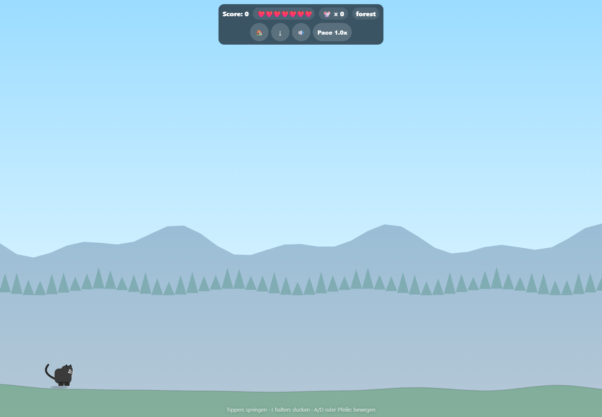
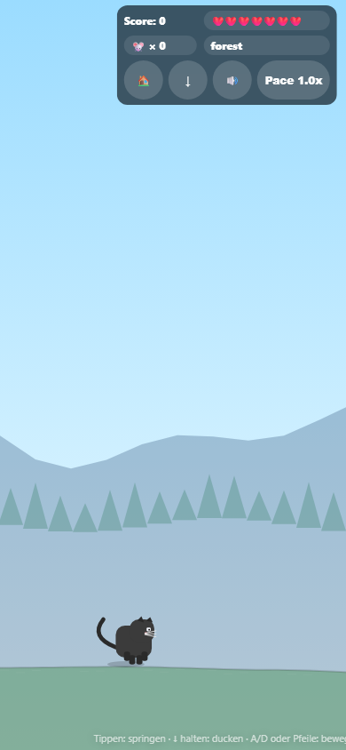
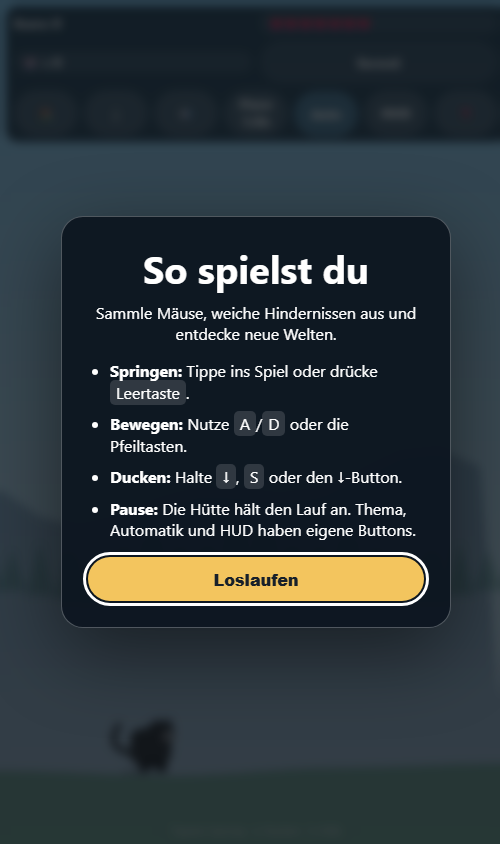
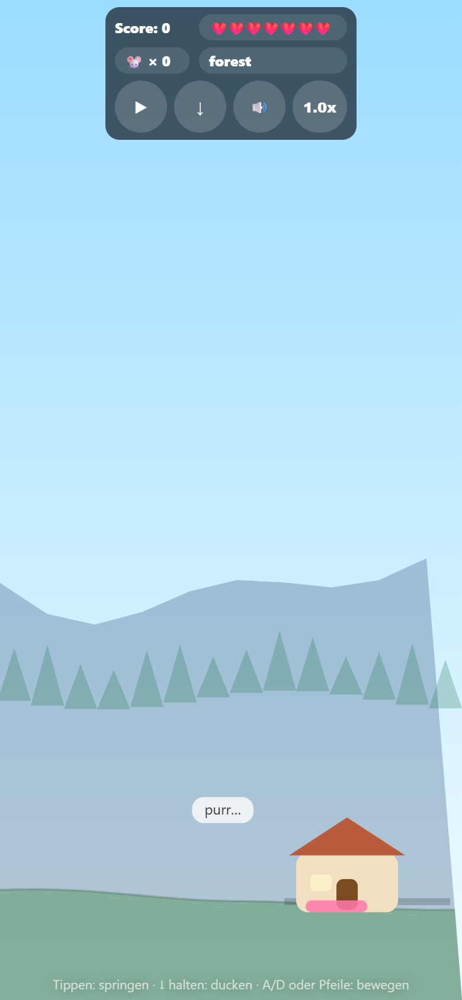

# Projektstatus und technisches Audit

Stand: 2026-08-05
Geprüfter Branch: `main`

## Kurzurteil

`purrkour` ist ein visuell eigenständiger, modular aufgebauter Endless-Runner mit prozeduralem Canvas-Rendering, mehreren Themen, Setpieces, Fahrzeugen und Sammelobjekten. Die Modulaufteilung ist deutlich besser als beim Schwesterprojekt. Der Audit fand jedoch vier unmittelbar spielrelevante Risiken sowie wirkungslose Qualitätsgates; diese P0-Punkte sind im ersten Maßnahmenblock behoben und automatisiert abgesichert worden.

Die bestätigten technischen und produktbezogenen Befunde sind umgesetzt. Verbleibend sind vor einem öffentlichen Release vor allem manuelle Langstrecken-, Geräte-, Screenreader- und Rechteprüfungen.

## Umsetzungsstand nach dem ersten Maßnahmenblock

| ID | Status | Ergebnis |
|---|---|---|
| PURR-01 | erledigt | AudioContext entsteht erst durch Nutzergeste; Ambience wird bis zum Unlock gepuffert |
| PURR-02 | erledigt | fixer 60-Hz-Simulationsschritt mit Delta-Cap und Tests für 30/60/120/144 Hz |
| PURR-03 | erledigt | ESLint-Glob aktiv; echte Regeln greifen und `--max-warnings=0` verhindert neue Warnschulden |
| PURR-04 | erledigt | semantischer 44-px-Touchbutton für Ducken nutzt denselben Input-State wie die Tastatur |
| PURR-05 bis PURR-07 | erledigt | kanonischer Reset, funktionierender Theme-Fade und Debug-Gating über `?debug=1` |
| PURR-08 | erledigt | 16 Node-Tests, dauerhafter Headless-Chrome-Smoke-Test, CI und reproduzierbarer Release-Build |
| PURR-09, PURR-10 | erledigt | ES-Modul-Paket und zustandsabhängige HUD-Updates |
| PURR-11 | erledigt | Resize migriert Terrain, Katze, Objekte und Effekte, ohne Progression oder Spawner zurückzusetzen |
| PURR-12, PURR-13 | erledigt | First-run-Hilfe, kurze Mobile-Hilfe, semantische Theme-/Auto-/HUD-Aktionen, Zielgrößen, Fokus, Zoom und ARIA umgesetzt |
| PURR-14 | erledigt | 23 Warnungen entfernt, doppelte/unreferenzierte Module gelöscht und Warnbudget auf null gesetzt |
| PURR-15 | erledigt | Bonusleben verbraucht jeden 60-Punkte-Meilenstein exakt einmal |
| PURR-16 | erledigt | gemeinsame getestete Storage-Abstraktion schützt Theme, Audio, Onboarding und Bestwert |
| PURR-17 | erledigt | eigener Game-over-Dialog hält den Run an und zeigt Score, Bestwert sowie bewussten Neustart |
| PURR-18 | erledigt | Hook reicht `$1` weiter; gültige Nachricht endet 0, ungültige 1 |
| PURR-19 | erledigt | durch aktiven Linter entdeckten undefinierten City-Renderer entfernt |

## Aktueller Aufbau

- Statische Webanwendung mit nativen ES-Modulen und Canvas-2D-Rendering.
- Funktionale Modulstruktur für Core, Game, World, Objects, Entities und Vehicles.
- Kein Buildschritt; `index.html` lädt `src/main.js` direkt.
- Endless-Runner mit scorebasierter Progression, Themenwechseln, saisonalen Overlays, Ocean-/Rocket-Setpieces und sieben Leben.
- Desktop: Sprung, Links/Rechts und Ducken; Debug-Hotkeys sind nur mit `?debug=1` aktiv.
- Touch: Pointer löst Sprung aus, ein sichtbarer Button erlaubt Ducken. Eine explizite Touch-Aktion für Links/Rechts fehlt weiterhin.
- Soundstatus und manuelle Themenwahl werden fehlertolerant persistiert.
- ESLint, Husky, Commitlint, 16 Node-Tests und ein echter Headless-Chrome-Smoke-Test sind wirksam; CI führt Check und Release-Build aus.

## Durchgeführte Prüfungen

| Prüfung | Ergebnis |
|---|---|
| Git-Status und Upstream | sauber, `main` folgt `origin/main` |
| `npm run check` | erfolgreich; aktiver Linter plus 16/16 Tests |
| `npm run test:browser` | erfolgreich; echter Modulstart, dynamisches HUD und geöffnete Hilfe in Headless Chrome |
| `npm run build` | 47 Runtime-Dateien, 221.696 Bytes bei 750-KiB-Budget |
| `npm run lint` | 0 Fehler, 0 Warnungen; Warnbudget ist null |
| ESLint `--print-config` | `no-undef` aktiv auf Fehler-, `no-unused-vars` auf Warnstufe |
| Desktop-Laufzeit, 1440 × 1000 | nach Änderungen erneut geladen und gerendert |
| Mobile-Laufzeit, 390 × 844 | nach Änderungen erneut geladen; Ducken- und Pauseinteraktion geprüft |
| Browserprotokoll | keine bestätigte Exception; kein AudioContext vor Nutzergeste |
| HUD-Ziele | mindestens 44 × 44 CSS-Pixel, auf Mobile sichtbar größer |
| Commit-Hook | gültige Conventional-Commit-Nachricht akzeptiert, ungültige abgelehnt |

## Befunde

Die Befunde beschreiben bewusst die bestätigte Ausgangslage. Der aktuelle Erledigungsstand steht in der Tabelle oben; so bleibt nachvollziehbar, warum die jeweilige Änderung vorgenommen wurde.

### P0 – zuerst beheben

#### PURR-01 · erledigt: Audio-Engine versuchte in jedem Frame zu entsperren

`src/game/loop.js` ruft bei aktiviertem Audio in jedem Frame die Theme-Ambience auf. `setAmbience()` ruft `ensureAll()`, und `ensure()` versucht bei einem gesperrten `AudioContext` wiederholt `resume()`. Im Browser wurde dadurch eine fortlaufende Warnungsserie aus `src/core/audio.js` bestätigt.

Maßnahme: AudioContext ausschließlich infolge einer echten Nutzergeste erstellen/fortsetzen. Vor erfolgreichem Unlock Ambience-Zielwerte nur puffern; danach Layer einmalig initialisieren.

Akzeptanz: Vor der ersten Interaktion wird kein AudioContext erzeugt und keine Browserwarnung protokolliert; nach Interaktion startet Audio einmalig; Mute/Unmute bleibt funktionsfähig.

#### PURR-02 · erledigt: Simulation hing vollständig von der Bildwiederholrate ab

Bewegung, Gravitation, Score, Timer, Setpiece-Phasen, Animationen und Progression rechnen in Einheiten pro `requestAnimationFrame`. Ein 120-Hz-Gerät führt deshalb grob doppelt so viele Simulationsschritte wie ein 60-Hz-Gerät aus. Das verändert Geschwindigkeit, Sprungkurven, Schwierigkeit und Dauer.

Maßnahme: Fixen Simulationsschritt mit Akkumulator oder konsequentes Delta-Time-Modell einführen; große Deltas nach Tab-Rückkehr begrenzen.

Akzeptanz: Derselbe automatisierte Ablauf ergibt bei simulierten 30, 60, 120 und 144 Hz innerhalb definierter Toleranzen dieselbe Distanz, Sprunghöhe und Timerdauer.

#### PURR-03 · erledigt: Der grüne Lint-Lauf prüfte die Regeln nicht

In `eslint.config.mjs` lautet das Dateimuster `*/.js`. Es passt nicht auf die JavaScriptdateien. `eslint --print-config` zeigt daher ein leeres Regelobjekt. Pre-commit-Linting und `npm run lint` geben aktuell falsche Sicherheit.

Maßnahme: Glob auf `**/*.js` korrigieren, Browserglobals vollständig definieren und Warnungen schrittweise auf Fehlerniveau anheben.

Akzeptanz: `--print-config` zeigt die erwarteten Regeln für Haupt- und Unterverzeichnisdateien; eine absichtlich undefinierte Variable lässt den Lint-Lauf scheitern.

#### PURR-04 · erledigt: Mobile Nutzer konnten nicht ducken

Tunnelkollisionen akzeptieren nur `game.input.crouch`, das ausschließlich durch Pfeil runter oder S gesetzt wird. Pointereingabe löst nur Sprung aus. Damit ist ein ausdrücklich vorgesehenes Gameplay-Manöver auf Touchgeräten nicht verfügbar.

Maßnahme: Gut erreichbare Touch-Aktion oder Swipe-down mit visueller Einführung und klarer Rückmeldung ergänzen. Touch und Tastatur müssen denselben Input-State verwenden.

Akzeptanz: Ein automatisierter mobiler Ablauf kann einen Tunnel ohne Lebensverlust passieren; die Aktion kollidiert nicht mit Sprung und HUD-Bedienung.

### P1 – Stabilität und Produktqualität

#### PURR-05 · erledigt: Game-over-„Neustart“ setzte den Lauf nicht vollständig zurück

`resetAll()` setzt Score, Leben und einige Timer zurück, nicht jedoch Progression, Theme/Overlay, Setpiece-Zustand, Terrain, Spawn-Timer oder Pause-/User-Theme-Zustände. Nach spätem Game over kann der neue Lauf deshalb in einem alten Beat mit falschem `beatStartScore` weiterlaufen. Das kann die nächste Progressionsschwelle stark verschieben.

Maßnahme: Einen einzigen kanonischen `resetRun()`-Pfad definieren, der State und Subsysteme vollständig auf einen geprüften Initialzustand setzt.

Akzeptanz: State-Snapshot direkt nach Erststart und direkt nach Game-over-Reset ist bis auf zulässige Laufzeitwerte identisch.

#### PURR-06 · erledigt: Theme-Fade wurde beim manuellen Wechsel nicht aktiviert

`setupThemeHudToggle()` ersetzt `game.themeFade` ohne `active: true`. Loop und Background verarbeiten den Fade nur bei aktivem Flag. Der kommentierte sanfte Wechsel findet deshalb nicht statt.

Maßnahme: Themenwechsel über eine einzige API führen, die Zustand, Persistenz und Fade konsistent setzt.

#### PURR-07 · erledigt: Debugsteuerung war im Produktionsspiel aktiv

H, M, O, 1, 2, 3 und R verändern HUD, Progression, Theme oder laden die Seite neu. Das kollidiert mit erwartbaren Nutzereingaben; insbesondere M wird häufig für Mute erwartet. Die globalen Helfer `speedUp()` und `speedDown()` verändern außerdem das nicht vorhandene Feld `game.baseSpeed` statt `game.speed`.

Maßnahme: Debugfunktionen nur über expliziten Query-Parameter oder Development-Build aktivieren; Helfer auf die öffentliche Speed-API umstellen.

#### PURR-08 · erledigt: Tests prüften kein echtes Spielverhalten

`tests/smoke.test.js` liest Dateien und extrahiert Strukturen mit regulären Ausdrücken. Module werden nicht importiert, Zustände nicht simuliert und Browserabläufe nicht gestartet. Änderungen an Physik, Reset, Input, Audio oder Rendering bleiben unentdeckt.

Umsetzung: Das ES-Modul-Paket besitzt 16 direkte Node-Tests für Audio, HUD, Storage, State, Resize und Timing. Ein dauerhafter Chrome-Smoke-Test startet einen isolierten lokalen Server und prüft echten Modulstart, Canvas, dynamisches HUD und Onboarding. GitHub Actions führt `npm ci`, das vollständige Gate und den Release-Build aus.

Akzeptanz: Tests decken mindestens Initialzustand, Reset, Progression, Frame-Raten-Unabhängigkeit, Input-Mapping und Audio-Unlock ab.

#### PURR-09 · erledigt: Pakettyp widersprach dem Anwendungscode

`package.json` deklariert `commonjs`, während die gesamte Anwendung ES-Module verwendet. Browserseitig funktioniert das, aber Node kann `src/main.js` nicht normal parsen/importieren. Das verhindert einfache modulbasierte Tests.

Maßnahme: `type: module` setzen und CommonJS-Konfigurationen/Tests explizit als `.cjs` führen.

#### PURR-10 · erledigt: HUD erzeugte in jedem Frame unnötige DOM-Arbeit

`hud.sync()` läuft pro Frame und baut dabei unter anderem die sieben Herz-Spans über `innerHTML` neu auf, auch wenn sich kein Wert geändert hat. Auf Geräten mit hoher Bildrate verschärft das die ohnehin frameabhängige Last.

Maßnahme: HUD nur bei Zustandsänderungen aktualisieren oder zuletzt gerenderte Werte cachen; Herzen einmal erzeugen und nur Klassen toggeln.

#### PURR-11 · erledigt: Resize veränderte einen laufenden Run

Jedes Resize initialisiert Terrain und Spawner neu und teleportiert die Katze, während bestehende Objekte und Progression bestehen bleiben. Mobile Browserleisten und Rotation können dadurch das Gameplay unerwartet verändern.

Umsetzung: Die initiale Weltanlage ist jetzt vom späteren Layout-Resize getrennt. Terrainform, Katze, aktive Objekte, Spuren, Sprechblasen und Partikel werden vertikal migriert; Score, Progression und Spawn-Timer bleiben erhalten. Zwei Modultests prüfen Höhen- und Breitenänderungen sowie die Objektmigration.

#### PURR-12 · erledigt: Bedienung und wichtige Funktionen waren kaum auffindbar

Der sichtbare Hinweis lautet nur `Purrkour ❤️`. Links/Rechts, Ducken, Pause, Speed, Themenwechsel und Long-Press-Verhalten werden nicht erklärt. Der Theme-Wechsel liegt auf einem nicht semantischen Textfeld; der Minimalmodus auf einem unsichtbaren Long-Press-Ziel.

Umsetzung: Eine beim ersten Start automatisch geöffnete und jederzeit über `?` erreichbare Hilfe erklärt Ziel und Eingaben. Themenwechsel, Themenautomatik und Kompaktansicht sind eigenständige semantische Buttons; die beiden versteckten Long-Press-Gesten wurden entfernt. Während der Hilfe pausiert die Simulation.

#### PURR-13 · erledigt: Touch-Ziele und Zoom erfüllten grundlegende Accessibility-Ziele nicht

Die gemessenen Buttons sind nur etwa 29 px hoch; als robuste Touch-Ziele sollten sie ungefähr 44 × 44 CSS-Pixel erreichen. `user-scalable=no` und `maximum-scale=1` verhindern Browserzoom. Emoji-Buttons haben keine stabilen ARIA-Namen oder Zustandsansagen.

Umsetzung: Controls haben mindestens 44 CSS-Pixel, sichtbare Tastaturfokusse und stabile Namen/Zustände. Leben erhalten eine textuelle ARIA-Zusammenfassung, Dialoge native Semantik, der Viewport bleibt zoomfähig und der mobile HUD bricht kontrolliert um.

### P2 – Aufräumen und Politur

#### PURR-14 · erledigt: Toter und doppelter Code

`src/world/lakes.js` wird durch ein No-op in `main.js` ersetzt. `src/objects/object.js` dupliziert Teile von `objects.js` und wird nicht importiert. Der `finished`-State wird geprüft und zurückgesetzt, aber nirgends gesetzt.

Umsetzung: Die unimportierten Doppeldateien `objects/object.js` und `world/lakes.js` wurden entfernt. Tote Imports, Argumente, Variablen und der unerreichbare Tunnel-Wahrscheinlichkeitsrest sind bereinigt; vorhandene Höhenwolken und Partikel-APIs sind wieder an aktive Renderpfade angeschlossen. ESLint akzeptiert keine Warnungen mehr.

#### PURR-15 · erledigt: Bonusleben konnte an Score-Vielfachen erneut erscheinen

Solange der Score exakt durch 60 teilbar ist, wird nach Einsammeln eines Bonuslebens bei weiterhin nicht vollen Leben erneut eines geplant, da nur nach einem aktuell ungenommenen Objekt gesucht wird.

Maßnahme: Nächsten erreichten Meilenstein explizit im State speichern.

#### PURR-16 · erledigt: Persistenz war unvollständig und nicht fehlertolerant

Das initiale Theme wird aus `localStorage` gelesen, aber von der Anwendung nicht geschrieben. Storage-Zugriffe sind nicht gegen gesperrten oder vollen Speicher abgesichert.

Umsetzung: Eine getestete Safe-Storage-Abstraktion kapselt Lesen, Schreiben und Löschen mit sicheren Rückgabewerten. Theme, Audio, Onboarding und Bestwert nutzen denselben Backend-Wrapper; blockierter, voller oder fehlender Storage unterbricht das Spiel nicht.

#### PURR-17 · erledigt: Game-over-Rückmeldung war zu kurz

Die Meldung kündigt einen Neustart an, der bereits nach 450 ms erfolgt und die visuelle Rückmeldung wieder löscht. Das ist kaum lesbar und bietet keine Wahl.

Umsetzung: Bei null Leben setzt der Collider einen echten `finished`-Zustand. Ein modaler Dialog zeigt Score und fehlertolerant gespeicherten Bestwert und bleibt stehen, bis die Person bewusst „Erneut spielen“ auswählt. Der Neustart verwendet weiterhin den kanonischen Reset-Pfad.

#### PURR-18 · erledigt: Commit-Message-Hook war wirkungslos

`.husky/commit-msg` ruft Commitlint mit leerem `--edit`-Pfad auf. Der geprüfte Aufruf beendet sich erfolgreich, ohne eine Nachricht zu validieren.

Maßnahme: Das von Husky übergebene erste Argument korrekt an Commitlint weiterreichen und den Hook mit gültiger sowie ungültiger Nachricht testen.

#### PURR-19 · erledigt: Undefinierter City-Renderer

Nach Aktivierung der tatsächlich wirksamen ESLint-Regeln wurde in `src/world/background.js` ein Verweis auf `drawCitySkyline` gefunden, obwohl diese Funktion nirgends definiert war. Der vorhandene Inline-Fallback war damit nur über eine unmögliche Abfrage erreichbar.

Umsetzung: Die tote Abfrage wurde entfernt und der vorhandene City-Renderer direkt verwendet. `no-undef` meldet nun keinen Fehler mehr.

## Perspektiven

- Entwickler: Gute Modulrichtung, aber wirkungslose Gates und framegebundener State verhindern sichere Weiterentwicklung.
- UX: Der Runner startet schnell, erklärt aber weder Basis- noch Spezialinteraktionen; Game over und Reset wirken unfertig.
- UI: Atmosphäre und Themen funktionieren, HUD und Controls sind auf großen Screens sehr klein und auf Mobile nicht ausreichend bedienbar.
- Anwender: Springen ist sofort verständlich, Ducken und versteckte Funktionen dagegen nicht; Verhalten variiert je nach Display-Hz.
- Betrieb: CI, Browser-Smoke, Allowlist-Build mit 750-KiB-Budget, README, Asset-Inventar und Release-Checkliste schaffen einen reproduzierbaren statischen Releasepfad.

## Verbleibende Releaseprüfungen

1. Vollständigen Progressionszyklus inklusive Ocean-/Rocket-Setpieces manuell durchspielen.
2. Physisches Touchgerät, reale Rotation, Screenreader und mindestens Firefox/Safari prüfen.
3. Urheber und Freigabe des Favicons dokumentieren; das technische Inventar liegt in `docs/ASSETS.md`.
4. Den ersten CI-Lauf auf GitHub kontrollieren und anschließend nur `dist/` deployen.

## Browser-Nachweise

Desktopansicht nach Fixes:

Aktuelle schmale Hochkantansicht mit allen sichtbaren Basisaktionen:

First-run-Hilfe in der schmalen Hochkantansicht:

Mobiler Hochkant-Viewport im geprüften Pausezustand; der erste Button ist semantisch und visuell auf „Weiterspielen“ gewechselt:

## Nicht geprüft / Restrisiken

- Kein vollständiger manueller Durchlauf aller Progressionsbeats und Setpieces.
- Keine reale Prüfung mit 120-/144-Hz-Monitor, physischem Touchgerät oder Screenreader; Bildraten und Touch wurden automatisiert simuliert.
- Keine Audioqualitätsprüfung mit aktiv entsperrter Ausgabehardware.
- Keine Prüfung von Cross-Browser-Unterschieden oder Asset-/Lizenzrechten.
